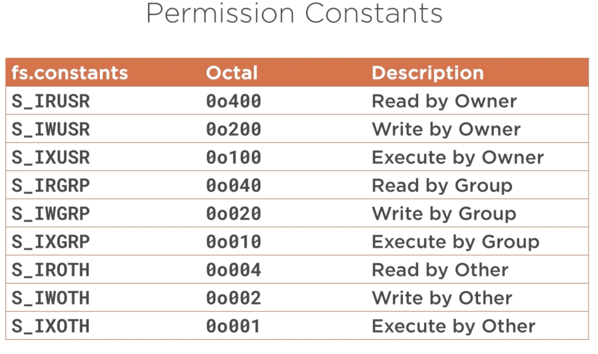

# Managing-Files-with-Node.js

**<font size="5">Reading an Entire File</font>**

&nbsp;&nbsp;&nbsp;**<font size="4">Reading a File Asynchronously</font>**

&nbsp;&nbsp;&nbsp;How to read a file using the asynchronous readFile function in the fs API of Node.js.

&nbsp;&nbsp;&nbsp;There are three arguments:  filename, encoding and callback_function

```js
const { convertCsv } = require('./csv.parse');
const { readFile } = require('fs');

readFile('./data/pulitzer-circulation-data.csv', 'utf8', (err, data) => {
    const vals = convertCsv(data);

    console.log(vals);
})
```

&nbsp;&nbsp;&nbsp;**<font size="4">Handling Asynchronous Erros</font>**
Changing the name of the file will give us an error

```js
const { convertCsv } = require('./csv.parse');
const { readFile } = require('fs');

readFile('./data/pulitzer-circulation-data.cs', 'utf8'ev, (err, data) => {
    if(err) {
        console.log(`There was a problem with the file ${err}`);
        return;
    }
    const vals = convertCsv(data);

    console.log(vals);
})
```

&nbsp;&nbsp;&nbsp;If we don't specify the encoding for this function, it will read it into a Buffer of bytes.

```js
const { convertCsv } = require('./csv.parse');
const { readFile } = require('fs');

readFile('./data/pulitzer-circulation-data.csv', (err, data) => {
    if(err) {
        console.log(`There was a problem with the file ${err}`);
        return;
    }
    const vals = convertCsv(data);

    console.log(vals);
})
```

&nbsp;&nbsp;&nbsp;If we don't have a callback an error saying "Callback must be a function" will appear. The solution is to make sure that you have a callback that you have a callback that takes both an error and a data property.
```js
const { convertCsv } = require('./csv.parse');
const { readFile } = require('fs');

readFile('./data/pulitzer-circulation-data.csv', 'utf8');
```

&nbsp;&nbsp;&nbsp;**<font size="4">Reading a File Synchronously</font>**

&nbsp;&nbsp;&nbsp;Even though Javascript is asynchronous at its core, there are still times that it's desirable to perform a synchronous action.

&nbsp;&nbsp;&nbsp;A common use case is that you want to load data from a file and then do something with it, and until that data is loaded you do not want your application to continue.

```js
const { convertCsv} = require('./csv.parse');
const { readFileSync } = require('fs');

const data =readFileSync('./data/pulitzer-circulation-data.csv', 'utf8');

console.table(convertCsv(data));
```

&nbsp;&nbsp;&nbsp;The synchronous method don't have the callback, therefore we don't have the error but we have a throw errors and it will cause the application to crash.

&nbsp;&nbsp;&nbsp;We can implement a try catch for the application not to crash.

```js
const { convertCsv} = require('./csv.parse');
const { readFileSync } = require('fs');


try {
    const data =readFileSync('./data/pulitzer-circulation-data.csv', 'utf8');
    console.table(convertCsv(data));
} catch (err) {
    console.log(`There was a problem with the file ${err}`)
}
```

&nbsp;&nbsp;&nbsp;We will see an error description,  but we won't see a stack trace on the console. That´s because the catch handles the error, displays a message and the allows the application to complete successfully.

&nbsp;&nbsp;&nbsp;<font size="3"><strong>This method will block all the other code. If the file we are reading was enormous,it's likely that the node application would sit at the readFileSync line for a quite some time.</strong></font>


**<font size="4">&nbsp;- Reading Asynchronously without Callbacks</font>**

&nbsp;&nbsp;&nbsp;To avoid the callbacks while simultaneously not writing blocking Javascript code.

&nbsp;&nbsp;&nbsp;To convert the readFile function to not require a callback, we have to pass that function to promisify.
After that we have a function, readFile, that requires a promise instead of requiring a callback.

```js
const readFile = promisify(fs.readFile);
```

- fs.readFile is not a string, it is the actual function from fs.
- In order to promisify to work, the function that is getting promisified must have a callback that has the common error, then data parameters. If the order is different, you'll get unexpected results.

```js
const readFile = promisify(fs.readFile);

readFile('./data/pulitzer-circulation-data.csv', 'utf8')
    .then(data => console.table(convertCsv(data)))
    .catch(err => console.log(`File error: ${err}`))

```

**<font size="5">Reading Parts of a File</font>**

**<font size="4">&nbsp;- Opening a File to Read</font>**

&nbsp;&nbsp;&nbsp;When reading an entire file, Node takes care of opening a file and loading in the entire contents. However, when you want to read just part of a file, you have to break it down into multiple steps for Node.

&nbsp;&nbsp;&nbsp;The flexibility of only reading parts of a file comes with increased complexity in your code.

&nbsp;&nbsp;&nbsp;Since it is an async function the second parameter is a callback.

&nbsp;&nbsp;&nbsp;fd is the common abbreviation used for File descriptor. when a file is opened on an operating system, the operating system tracks the open file and places an identifier to that file in a table of open files. There is an identifier that can be used to access the file.

&nbsp;&nbsp;&nbsp;Since Node can run on multiple operating systems, the fs library abstracts away any of the differences and returns a numeric descriptor for each open file. Node then uses this file descriptor to look up the file from the operating system's file table, and the file table returns the desired file.

&nbsp;&nbsp;&nbsp;Most operating systems have limits about the number of files that can be opened at any given time. So to wrap up, a <strong>file descriptor</strong> can be thought of as a file identifier and it typically is stored in a variable named fd.


&nbsp;&nbsp;&nbsp; We need to give the read function a buffer that the file can be read into. So we create a new Buffer that allocates 200 bytes long.

&nbsp;&nbsp;&nbsp; This is not an offset for the file, but for the buffer. If I set an offset of 5, the first byte read from the file would be stored in the fifth byte in the buffer, and bytes 1 through 4 would be 0. We don't want an offset so we'll set that to 0.

&nbsp;&nbsp;&nbsp; Now we need to tell read how many bytes we want to read from the file. we set buffer.length for the entire buffer.
&nbsp;&nbsp;&nbsp; To tell the function where to start reading in the file we set 0 to start at the beginning.
```js
const { open, read } = require('fs');

open('./data/pulitzer-circulation-data.csv', (err, fd) => {
    const buffer = Buffer.alloc(200);
    read(fd, buffer, 0, buffer.length, 0, (err, count, buff) => {
    console.table(convertCsv(buff.toString()));
    })
});

```

&nbsp;&nbsp;&nbsp;We've told read what file to read from, where to store the data, where in our buffer to start storing that data, how much data to read in, and where in our file to start reading.

&nbsp;&nbsp;&nbsp;Sinces it is read and not readSync, it's asynchronous. So we need to pass it a callback.

&nbsp;&nbsp;&nbsp; <strong>count</strong> parameter is the number of bytes that were read.

&nbsp;&nbsp;&nbsp; <strong>buff</strong> parameter is the data that was read.

**<font size="4">&nbsp;- Reading a Chunk at a time</font>**

&nbsp;&nbsp;&nbsp; To be able to read through a file a chunk at a time, we need to know how big the file is so we know how many total bytes we'll need to read.

```js
const fs = require('fs');

let totalSize = 0;
fs.stat('./data/app.log', (err, {size}) => totalSize = size);

fs.open('./data/app.log', (err, fd) => {
    const buffer = Buffer.alloc(200);

    for(let i = 0; i <= totalSize / buffer.length; i++) {
        fs.read(fd, buffer, 0, buffer.length, i*buffer.length, (err, count, buff) => {
            console.log(buff.toString());
        })
    }
})

```

&nbsp;&nbsp;&nbsp; There are two points in particular to notice here. 

&nbsp;&nbsp;&nbsp; - First, the second term in the loop is the totalSize divided by buffer.length. That is, it's the totalSize divided by the individual chunks that we're going to use. This gets us the total number  of times that we need to loop through this routine.

&nbsp;&nbsp;&nbsp; - Second, the position parameter in read is now set to 200 bytes times the number of the iteration, so the first one will be 0, and then we'll start it by 200, and then start it by 400, etc.

&nbsp;&nbsp;&nbsp; There's two problems with the solution, though.

&nbsp;&nbsp;&nbsp; - First, it's not great that we have to keep track of how big our buffer is everywhere. We're probably managing more state than we really want to be. We're not just reading a file, but we're keeping track of where we are in the file. However, that's probably not the biggest problem.

&nbsp;&nbsp;&nbsp; -  Does the last line of the file app.log, line 1000 match the output of the terminal? It cuts off the last line before reading it, and that's because we're executing read in a for loop, and read is asynchronous and there's no guarantee of the order that the functions will return.

```js
    .
    .
    .
    122.248.119.131 - hilpert6706 [21/09/2019:10:07:21 -0500] "POST /synergies/architect/benchmark/benchmark" 400 4673
    163.3.217.18 - - [21/09/2019:10:07:21 -0500] "GET /dot-c
    om" 405 21512mesh" 304 26679
    122.248.119.131 - hilpert6706 [21/09/2019:10:07:21 -0500] "POST /synergies/architect/benchmark/benchmark" 400 4673
    163.3.217.18 - - [21/09/2019:10:07:21 -0500] "GET /dot-c
```

**<font size="4">&nbsp;- Reading Parts Synchronously</font>**

&nbsp;&nbsp;&nbsp; By reading parts of a file synchronously, we'll be able to guarantee the data all comes back in the right order.

```js
    const fs = require('fs');

    const fd = fs.openSync('./data/app.log');

    const buffer = Buffer.alloc(200);

    fs.readSync(fd, buffer, 0, buffer.length, 0);

    console.log(buffer.toString());

```
&nbsp;&nbsp;&nbsp; read's callback took two parameters besides the err parameter, it took a count and a buff parameter.
&nbsp;&nbsp;&nbsp; readSync returns the first parameter or the number of bytes read.

&nbsp;&nbsp;&nbsp; So how do we get access to the data that was read? The buffer that was created was updated through the process of readSync. So to get the data displayed on the screen, simply log out buffer.toString().

&nbsp;&nbsp;&nbsp; This solves the first problem from the previous code. The fyle is now read synchronously. But how can we use this to chunk through an entire file?

&nbsp;&nbsp;&nbsp; The first thing we need to do is create a variable to hold the number of bytes read.

```js
    const fs = require('fs');

    const fd = fs.openSync('./data/app.log');

    let count = 0;

    do {
        const buffer = Buffer.alloc(200);

        count = fs.readSync(fd, buffer, 0, buffer.length, null);

        console.log(buffer.toString());
    } while (count > 0)

```
&nbsp;&nbsp;&nbsp;- First, the buffer is created inside the do statement. We want to re-initialize this buffer with all zeroes every single time we read it, otherwise when we get to the end there might be some leftover data.

&nbsp;&nbsp;&nbsp;- Second, the position parameter for readSync has changed from 0 to null. If the value is null, Node wil actually keep track of where it was in the file and pick up there the next time you try to read.


**<font size="4">&nbsp;- Managing Files with Node.js</font>** (./file.descriptor.error.js)

&nbsp;&nbsp;&nbsp;<strong>Files descriptors (fd)</strong> have the ability to crash the application, but the prevention is actually pretty simple.

&nbsp;&nbsp;&nbsp;Let's start by looking at what the <strong>file descriptors </strong> can do.

```js
const fs = require('fs');

console.log('Opening files...');
for (let index = 0; index < 50000; index++) {
    const fd = fs.openSync('./data/app.log');    
    console.log(fd);
}
```

```js
    .
    .
    122877
    122878
    22879
    node:internal/fs/utils:348
        throw err;
    Error: EMFILE: too many open files, open './data/app.log'
```

&nbsp;&nbsp;&nbsp;The terminal output the file descriptor each time a new file was opened before it eventually crashed. The number might be different depending on the OS and some other settings.

&nbsp;&nbsp;&nbsp;Most operating systems have limits about the number of files that can be open at any given time. This is the error that we're seeing. We're asking the OS to open more files that it allows.

&nbsp;&nbsp;&nbsp;Notice that the error isnt that the operating system limits the number of files that your process can open. The operating system is limiting the total number of open files, including files opened by other applications, so our code need so be a good community member and not contribute needlessly to that number.

&nbsp;&nbsp;&nbsp;To prevent that error from happening: If I close this file, this error will not happen.

```js
    const fs = require('fs');

    console.log('Opening files...');
    for (let index = 0; index < 185000; index++) {
        const fd = fs.openSync('./data/app.log');    
        console.log(fd);
        fs.closeSync(fd);
    }
```
```js
    23
    23
    23
    23
    23
    23
    23
```
&nbsp;&nbsp;&nbsp;It reused the same file descriptor (23 in my case). When we close the file it frees up that file descriptor from the table so it can be reused. In fact, if you were to use <strong>fs.close</strong>  instead of <strong>fs.closeSync,</strong> you would see that fd fluctuates between at least two numbers and possibly more.

```js
    const fs = require('fs');

    console.log('Opening files...');
    for (let index = 0; index < 185000; index++) {
        const fd = fs.openSync('./data/app.log');    
        console.log(fd);
        fs.close(fd, () => {});
    }
```
```js
    26
    28
    23
    24
    26
    23
    24
    23
    26
    28
    29
    30
    31
    32
    33
    34
```

&nbsp;&nbsp;&nbsp;Any time we use open or openSync, we need to call the corresponding close or closeSync.

&nbsp;&nbsp;&nbsp;If we pass a string or a path such as a file.csv. In this situation readFile() will close the file for us because we're providing it a path to the file. 

```js
    readFile('file.csv', 'utf8', (err, data) => {

    })
```

&nbsp;&nbsp;&nbsp;However, if we tweak that code slightly by passing in a file descriptor like this:
```js
    readFile(fd, 'utf8', (err, data) => {
        
    })
```

&nbsp;&nbsp;&nbsp;<div style="text-align: left">readFile() will not close that file for us, because it will not close a file descriptor, and the code above is a perfectly valid use of readFile, it doesn't have to take a string, it can take a <strong>file descriptor</strong>.</div>

<font size="4">&nbsp;&nbsp;&nbsp;<div style="text-align: left"><strong>any time we have a file descriptor, we are responsible for closing that file.</strong></font> If we don't, we're exposing ourselves to the risk of opening too many files and crashing the application.</div>

<font size="5">&nbsp;<strong> writing to a File</strong></font>

&nbsp;&nbsp;&nbsp;<div style="text-align: left">Since I'm using Node, one situation I might run into is needing to export my source code so that other developers can use it. These export libraries can be installed by others using npm, but before they can be installed by npm, they need to be created by me.</div>

&nbsp;&nbsp;&nbsp;<div style="text-align: left">In some cases, creating a library is as simple as exporting a single file to a package sharing a single file, but often it's much more difficult than that.</div>

<font size="4">&nbsp;&nbsp;&nbsp;<strong>- Writing an Entire File</strong></font>

All sync functions need to have a callback.


```js
import { writeFile } from 'fs';


writeFile('./data/app.log',
    '163.3.217.18 - - [21/09/2019:10:07:21 -0500] "GET /write-file-test" 405 21512',
    (err) => {
        err ? console.log(err) : console.log('file saved!');
    });
```

<font size="4">&nbsp;&nbsp;&nbsp;<strong>- Appending to a File</strong></font>

&nbsp;&nbsp;&nbsp;In order to append data to the file, instead of just overwriting the data.

&nbsp;&nbsp;&nbsp;The parameters for writing asynchronously are:
- The Path to the file we want to write.
- The contents of the data that we want to write.
- The callback.
- Optional. The Options parameter comes between the data and the callback. This is a string and it tells the writeFile function how it needs to open the file. The <strong>default flag is w</strong>, which simply means overwrite the file, create it if it doesn't exist.

&nbsp;&nbsp;&nbsp;<div style="text-align: left">We need to pass in an object as the third parameter. And inside this object we need to specify the flag parameter and set it to the string <strong>'a'</strong> for append.</div>

```js
import { writeFile } from 'fs';


writeFile('./data/app.log',
    '163.3.217.18 - - [21/09/2019:10:07:21 -0500] "GET /write-file-test" 405 21512',
    {flag: 'a'},
    (err) => {
        err ? console.log(err) : console.log('file saved!');
    });
```

&nbsp;&nbsp;&nbsp;<div style="text-align: left">Another way to append a file is changing the <strong>writeFile</strong> function by <strong>appendFile</strong> and removing the option object from the parameter.</div>

&nbsp;&nbsp;&nbsp;<div style="text-align: left">Much like the writeFile function defaults the flag to w, the append file defaults the falg to a.</div>

&nbsp;&nbsp;&nbsp;<div style="text-align: left">Even though appendFile exists, it's still important to know about the options object because there are other flags that do not have the corresponding functions defined.</div>

&nbsp;&nbsp;&nbsp;<div style="text-align: left">Additionally, there are other options available for when you write a file. For instance, If you wanted to know how to write a Base64 file but throw an exception if the file already exists.</div>

```js
import { appendFile } from 'fs';


appendFile('./data/app.log',
    '163.3.217.18 - - [21/09/2019:10:07:21 -0500] "GET /write-file-test" 405 21512',
    (err) => {
        err ? console.log(err) : console.log('file saved!');
    });
```

<font size="4">&nbsp;&nbsp;&nbsp;<strong>- utilizing Options</strong></font>

<div style="text-align: left">&nbsp;&nbsp;&nbsp;In Node the X flag is the exclusive flag, and it can be added to other flags such as w, which will cause the system to throw an error if the file already exists.</div>

<div style="text-align: left">&nbsp;&nbsp;&nbsp;Setting the flag parameter to <strong>WX</strong>, </div>

```js
import { appendFile } from 'fs';

appendFile('./data/app.log',
    '163.3.217.18 - - [21/09/2019:10:07:21 -0500] "GET /write-file-test" 405 21512',
    (err) => {
        err ? console.log(err) : console.log('file saved!');
    });

    [Error: EEXIST: file already exists, open './data/app.log'] {
  errno: -17,
  code: 'EEXIST',
  syscall: 'open',
  path: './data/app.log'
}
```

&nbsp;&nbsp;&nbsp;<strong>File Flag parameter Options</strong>
- r : Read mode.
- w : Write mode.
- a : Append mode.

&nbsp;&nbsp;&nbsp; <strong>Add-on Flags</strong>
- X : Exclusive.
- "+" : Multiple modes. Used to open a file in multiple modes. 
  <strong>r+</strong> will open the file for both reading and writing. 
  <strong>w+</strong> will also open the file for both reading and writing. The difference is that if the file does not exist, r+ will throw an exception and w+ will create the file.
  <strong>a+</strong>, much like w+, will open a file for both reading and appending, and it'll create the file if it does not exist.

- S : Synchronous. For example, rs+ will open a file for reading and writing synchronously. Note in this case the s has to do with file I/O and not the Javascript function. That is, including the flag s will not convert open to openSync.

&nbsp;&nbsp;&nbsp; Allowed Combinations for Read

- r: For read mode.
- r+: For read and write mode.
- rs+: For read and write mode synchronously.

&nbsp;&nbsp;&nbsp; Allowed Combinations for Write

- w: Will open the file in write mode.
- wx: Will open the file in a write exclusive mode throwing an error if the file already exists.
- w+: will open the file in both read and write mode.
- wx+ will open a file in both read and write mode, and throw an error if the file already exists.

&nbsp;&nbsp;&nbsp; Allowed Combinations for Append.
- a: For append mode.
- ax: For exclusive append mode.
- a+: For append and read mode.
- ax+: For an exclusive append and read mode.
- as: For appending synchronously.
- as+ For appending and reading synchronously.

This will create a file newapp.log with the permissions that only the owner can read or write the file.

```js
import { constants, writeFile } from 'fs';
   writeFile('./data/newapp.log',
    '163.3.217.18 - - [21/09/2019:10:07:21 -0500] "GET /write-file-test" 405 21512',
    { mode: constants.S_IWUSR | constants.S_IRUSR},
    (err) => {
        err ? console.log(err) : console.log('file saved!');
    });

```

To see the permissions of each file in the data folder:
```js
    ls -l ./data
```

</img>

It can be used specifying the codes as following:
```js
    .
    .
   { mode: 0o600},
```

To encode the string we send to the file with base64, we use the parameter <strong>encoding</strong>
```js
import { writeFile } from 'fs';
   writeFile('./data/newapp.log',
    '163.3.217.18 - - [21/09/2019:10:07:21 -0500] "GET /write-file-test" 405 21512',
    { encoding: 'base64'},
    (err) => {
        err ? console.log(err) : console.log('file saved!');
    });

```

In addition to <strong>utf8</strong> and <strong>base64</strong>, Nodes supports <strong>ASCII</strong> encoding, <strong>utf16le or ucs2</strong> which both refer to 2 or 4 byte little-endian encoded Unicode characters. It supports <strong>latin1 or binary</strong>, which are both 1 byte encoded strings as defined by the IANA in RFC 134. And it supports a <strong>hex</strong> encoding which encodes each byte as two hexadecimal characters.

<font size="4">&nbsp;&nbsp;&nbsp;<strong>- Writing Parts of a File</strong></font>

The requirements when we're going to need when we build our index file.

- We'll open up a file index.js, and this will be the file that we're writing to.
- We'll get a list of files that we want to add in as exports to this file.
- We want to iterate over our list of files and create an export statement that exports a function with the same name as the file.
- We want to write to that file.
- We want to close the file.


<font size="4">&nbsp;&nbsp;&nbsp;<strong>- Watching files</strong></font>

&nbsp;&nbsp;&nbsp;I have now got a script that can output all of my hard work on reading files to a single index.js file, and as great as that is, what happens if I find a typo in one of my read files?
Or what if I add a new file to that folder? is there some way to have my index file auto-update?

&nbsp;&nbsp;&nbsp;To make my create.index file truly versatil, it would be great to let that script run and detect changes to the directory and files underneath that directory.

&nbsp;&nbsp;&nbsp;Node's fs module provides this exact functionality.

- The first parameter that the function takes is the path that is to be watched. This path can be either a single file or a directory. In this case I specified the entire read directory.
- The second parameter is an <strong>event listener</strong>. Technically this is not a callback, instead it's a listener or handler. It's called every time the watch event fires. One of the main differences is that there is no error parameter.
    This listener can take two parameters; the first one is the <strong>event type</strong>, which would be either a change or rename and the second one is the <strong>filename </strong>that was changed or renamed. We don't have to worry about the event type in this case.

```js
import { watch } from 'fs';

watch('./read', () => {})
```


```js
import { closeSync, openSync, readdirSync, watch, writeSync } from 'fs';
import camelCase from'camelcase';

watch("./read", () => {
  const indexFd = openSync("./index.js", "w");

  const files = readdirSync("./read");

  files.map(f => {
    const name = f.replace("js", "");
    console.log(`Adding a file: ${f}`);

    writeSync(
      indexFd,
      `module.exports.${camelCase(name)} = require('./read/${name}').read;\n`
    );
  });

  closeSync(indexFd);
});
```

&nbsp;&nbsp;&nbsp;When I run the file and modify any of the files I'll see the list of files scroll by on the screen and the index has been updated.

&nbsp;&nbsp;&nbsp;Similary if I rename one of the files, the process will run again and it updates the index.js with the name of the file.

<font size="5">&nbsp;<strong> Reading and Writing Streams</strong></font>

Reading small files does not have much of an impact on system resources. What happens if we need to read in a considerably larger file?.

To find out how large files perform, there's an open source tool named flog, which creates random log files.

Node tries to read in a much larger file and asign it to a string, and in doing so it exceeded the max characters a string can have.

```js
Error with file: Error: cannot create a string longer than 0x3fffffe7 characters
```

When we call readFile() it's opening the file and loading all of its contents, and in our case we're assigning that to a variable. This means the entire contents of my file is being placed in memory before being accessible to my code. This is relatively quick but it does eat up a lot of system resources. That's why we need streams.

<font size="4">&nbsp;&nbsp;&nbsp;<strong>- Reading Data from Stream</strong></font>

&nbsp;&nbsp;&nbsp;Handling a stream is similar to reading a file, but there's at least one noticeable difference. With streams you don't read the stream with a function, instead you create a stream and receive data via an event.

```js
import { createReadStream } from 'fs';

const stream = createReadStream('./data/app.log');

stream.on('data', data => console.log(data));

```

console output:
```js
<Buffer 32 32 37 2e 38 35 2e 32 36 2e 32 31 35 20 2d 20 2d 20 5b 32 31 2f 30 39 2f 32 30 31 39 3a 31 30 3a 30 37 3a 32 31 20 2d 30 35 30 30 5d 20 22 50 4f 53 ... 65486 more bytes>
<Buffer 22 48 45 41 44 20 2f 76 65 72 74 69 63 61 6c 22 20 35 30 32 20 31 34 30 32 31 0a 37 37 2e 39 38 2e 31 39 32 2e 33 32 20 2d 20 73 6b 69 6c 65 73 33 30 ... 29504 more bytes>
```
&nbsp;&nbsp;&nbsp;There are two lines displayed on the console, two separate buffers. The first one shows a buffer and states that there's an additional 65486 bytes left. The second buffer is similar, but it only has an additional 29504 bytes.

&nbsp;&nbsp;&nbsp;Both buffers display 50 bytes on the screen. With the first buffer, if I add those 50 bytes to 65486, see that the first buffer has 65536 bytes, or 64KB. This happens because the default size for a stream is 64KB. So what we're seeing on the screen is that our data event was actually called twice.

- Called #1: 64KB. The first time it had 64KB of data.
- Called #2: 29KB. It had the remainder of 29KB, because the file I'm loading is less than 128KB.

&nbsp;&nbsp;&nbsp;If our file had been, say, 129KB, the second buffer would have also been 64KB, the second buffer would have also been 64KB, and the last buffer would have only been 1KB.

&nbsp;&nbsp;&nbsp;We have the ability to change the 64KB default with a second object parameter in the createReadStream() function. We tell it the number of bytes to take at one time. This is called the <strong>highWaterMark</strong>. It's the maximum number of bytes that the stream will read at one point.

```js
import { createReadStream } from 'fs';

const stream = createReadStream('./data/app.log', { highWaterMark: 9550 });

stream.on('data', data => console.log(data));

```

&nbsp;&nbsp;&nbsp;This time I'll see 10 buffers displayed on my console.
```js
<Buffer 32 32 37 2e 38 35 2e 32 36 2e 32 31 35 20 2d 20 2d 20 5b 32 31 2f 30 39 2f 32 30 31 39 3a 31 30 3a 30 37 3a 32 31 20 2d 30 35 30 30 5d 20 22 50 4f 53 ... 9500 more bytes>
<Buffer 2d 20 77 69 7a 61 37 34 38 34 20 5b 32 31 2f 30 39 2f 32 30 31 39 3a 31 30 3a 30 37 3a 32 31 20 2d 30 35 30 30 5d 20 22 50 41 54 43 48 20 2f 70 72 6f ... 9500 more bytes>
<Buffer 65 64 6e 65 72 34 38 35 38 20 5b 32 31 2f 30 39 2f 32 30 31 39 3a 31 30 3a 30 37 3a 32 31 20 2d 30 35 30 30 5d 20 22 48 45 41 44 20 2f 65 78 70 65 64 ... 9500 more bytes>
<Buffer 3a 30 37 3a 32 31 20 2d 30 35 30 30 5d 20 22 50 4f 53 54 20 2f 63 6f 6e 76 65 72 67 65 6e 63 65 2f 65 66 66 69 63 69 65 6e 74 2f 6d 65 74 68 6f 64 6f ... 9500 more bytes>
<Buffer 6e 67 2f 61 72 63 68 69 74 65 63 74 2f 69 6e 66 6f 6d 65 64 69 61 72 69 65 73 22 20 34 30 30 20 31 35 33 36 38 0a 32 32 2e 37 32 2e 32 32 37 2e 31 32 ... 9500 more bytes>
<Buffer 30 3a 30 37 3a 32 31 20 2d 30 35 30 30 5d 20 22 50 55 54 20 2f 76 69 73 75 61 6c 69 7a 65 22 20 32 30 33 20 36 36 35 39 0a 35 38 2e 31 34 39 2e 31 35 ... 9500 more bytes>
<Buffer 2d 30 35 30 30 5d 20 22 50 4f 53 54 20 2f 6d 61 67 6e 65 74 69 63 2f 73 79 73 74 65 6d 73 2f 65 78 70 65 72 69 65 6e 63 65 73 22 20 35 30 31 20 32 38 ... 9500 more bytes>
<Buffer 32 31 20 2d 30 35 30 30 5d 20 22 50 41 54 43 48 20 2f 65 76 6f 6c 76 65 2f 73 74 72 61 74 65 67 69 7a 65 2f 77 65 62 2d 65 6e 61 62 6c 65 64 22 20 35 ... 9500 more bytes>
<Buffer 30 39 2f 32 30 31 39 3a 31 30 3a 30 37 3a 32 31 20 2d 30 35 30 30 5d 20 22 50 4f 53 54 20 2f 72 65 69 6e 74 65 72 6d 65 64 69 61 74 65 2f 62 72 69 63 ... 9500 more bytes>
<Buffer 30 5d 20 22 50 55 54 20 2f 32 34 2f 37 22 20 32 30 34 20 32 33 35 33 35 0a 32 34 37 2e 31 32 34 2e 31 33 36 2e 32 33 31 20 2d 20 2d 20 5b 32 31 2f 30 ... 9090 more bytes>
```

&nbsp;&nbsp;&nbsp;To see the content of our stream we use the <strong>encoding</strong> option

```js
import { createReadStream } from 'fs';

const stream = createReadStream('./data/app.log', { 
    highWaterMark: 9550,
    encoding: 'utf8' });

stream.on('data', data => console.log(data));

```
This time I can see the text of the file.
```js
.
.
.
249.134.114.45 - schamberger2582 [21/09/2019:10:07:21 -0500] "POST /niches/engineer/best-of-breed/architectures" 416 20715
96.130.94.188 - - [21/09/2019:10:07:21 -0500] "POST /deliver/scale/mesh" 304 26679
122.248.119.131 - hilpert6706 [21/09/2019:10:07:21 -0500] "POST /synergies/architect/benchmark/benchmark" 400 4673
163.3.217.18 - - [21/09/2019:10:07:21 -0500] "GET /dot-com" 405 21512163.3.217.18 - - [21/09/2019:10:07:21 -0500] "GET /write-file-test" 405 21512
```

&nbsp;&nbsp;&nbsp;Sometimes we need the stream to pause for a bit so that we can deal with the data that we're receiving.

<font size="4">&nbsp;&nbsp;&nbsp;<strong>- Pausing a Stream</strong></font>

&nbsp;&nbsp;&nbsp;Sometimes the stream can move faster than my code can handle.
&nbsp;&nbsp;&nbsp;To  manage the data in those situations.

&nbsp;&nbsp;&nbsp;The first thing we wanna do is tell the stream to temporarily stop sending data. We do by adding a line before the console.log() statement. We want to make sure that while we're processing this event we're not receiving an additional event, so calling pause first solves this for that.

```js
import { createReadStream } from 'fs';

const stream = createReadStream('./data/app.log', {
    highWaterMark: 9550,
    encoding: 'utf8'
});

stream.on('data', data => {
    stream.pause();
    console.log(data)
});

```

&nbsp;&nbsp;&nbsp;Pausing the data isn't enough, because that will only allow you to access the data up to the point that I pause.

&nbsp;&nbsp;&nbsp;There is also a resume function.

&nbsp;&nbsp;&nbsp;This code will run every two seconds and resume the stream.

```js
import { createReadStream } from 'fs';

const stream = createReadStream('./data/app.log', {
    highWaterMark: 9550,
    encoding: 'utf8'
});

stream.on('data', data => {
    stream.pause();
    console.log(data);

    setTimeOut
});

```

&nbsp;&nbsp;&nbsp;We can see the first block of 9550 bytes coming across. Then after two seconds we can see the next block of code. If I let this run for about 20 seconds, I'll eventually see the entire file again.

&nbsp;&nbsp;&nbsp;Part of the power of strams if that I can have input or readStreams, as well as output or writeStreams. This allows me the ability to bring in data from one method, process that data and send it out somewhere else.

<font size="4">&nbsp;&nbsp;&nbsp;<strong>- Writing to a Stream</strong></font>

Sometimes we want to be able to stream data out, for example to save it as a file.

```js
import { createReadStream, createWriteStream } from 'fs';

const stream = createReadStream('./data/app.log', {
    highWaterMark: 95,
    encoding: 'utf8'
});
```

By changing the highWaterMark from 9550 to just 95 allows us to simulate a longer running stream just for demostration purposes.


As it runs I'll start to see the numbers printed out to my console every second and if I open up the data ouput.log file, I can see some familiar log entries.

The createWriteStream function also takes some optional parameters. 
- Flags
- Encoding

Other than that, there isn't actually a lot to writing out to a stream, or at least there's less to configure than when reading from a stream.

Internally, console.log calls a stream to print data to the console. See that the process.stdout uses the familiar write function to send the data. That's because process.stdout is a stream.

```js
console.log = function (d) {
    process.stdout.write(d + '\n')
}
```

<strong> What happens when my output stream is slower than my input stream?</strong>

<font size="4">&nbsp;&nbsp;&nbsp;<strong>- Handling Mistmatched Streams</strong></font> 

&nbsp;&nbsp;&nbsp;<strong>The last example showed how to take data from one stream and send it to another stream. It was reading in from one file and writing out to another. Sometimes that action can cause problems.

&nbsp;&nbsp;&nbsp;<strong>As long as the output stream could handle the data that the input stream is providing, everything is good. Data comes in, is manipulated or processed, and sent out without a serious burden on the system resources. Even if the output stream is faster than the input stream, there's stil no problems. In that case the output stream is idle waiting on the next chunk of data from the input stream.

&nbsp;&nbsp;&nbsp;<strong>Unfortunately, that doesn't always happen. For example, writing a file is slower operation than reading a file, so it's possible that the output stream would start to build up a backlog of data that it needs to write out, adn the bigger the difference between the input and the processing output, the bigger that backlog is going to be. This problem is called <strong>back pressure.</strong>

<font size="3"><strong>Back pressure: </strong></font> A backup of data, caused by streams being unable to process data before the next batch arrvies.

If this isn't handle correctly, a memory issue can occur as the project's memory footprint grows bigger and bigger.

with the following code the counter will go to around 20000, and then an exception is thrown.

```js
import { createReadStream, createWriteStream, writeData } from 'fs';

/**
 * it load the 64KB in each chunk
 */
const stream = createReadStream('./data/stream.log', {
    encoding: "utf8"
});

const writer = createWriteStream("./data/output.log");

let iteration = 0;
/**
 * The data on event is not pausing the stream.
 * It is reading as fast as it possibly can.
 */
stream.on('data', data => {

    writeData(data); 
    setTimeout(() => {
        stream.resume();
    }, 1000)
});

const writeData = data => {
    /**
     * Most of the time We don't want to set a timeout in our code
     * This is only to simulate a write stream that is much slower than the read stream.
     */
    setTimeout(() => {
        writer.write(data);
    }, 6000)
}
```

&nbsp;&nbsp;&nbsp;<strong>An exception is thrown. That's because it's loaded to 1.8GB of data from the file. while it's loaded in the data there hasn't been any data written out.
```js
FATAL ERROR: CALL_AND_ENTRY_LAST Allocation failed - Javascript heap out of memory
```

&nbsp;&nbsp;&nbsp;<strong>Node has a function to help with that.

```js
import { createReadStream, createWriteStream } from 'fs';

/**
 * it load the 64KB in each chunk
 */
const stream = createReadStream('./data/stream.log', {
    encoding: "utf8"
});

const writer = createWriteStream("./data/output.log");

stream.pipe(writer);
```

&nbsp;&nbsp;&nbsp;<strong>We don't have anything output to the console, but the snippet runs quickly and returns to the shell. It was able to copy that nearly 2GB file without loading it all into a memory, and without running into a memory exception.